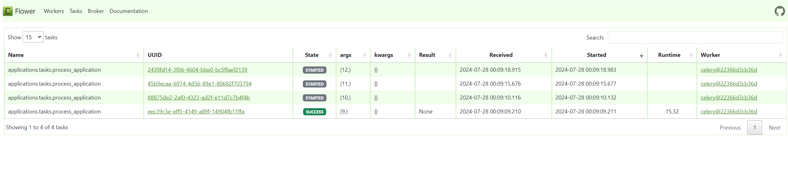

## Task manager - сервис для подачи и обработки заявок.

- [Описание](#desc)
- [Стек технологий](#stack)
- [Запуск проекта](#start)
- [Примеры запросов](#requests)
- [Примеры работы Flower](#flower)
- [Авторы](#team)


### Описание <a id="desc"></a>

**Task manager** - система управления задачами, поддерживает создание, чтение, обновление и удаление через API. При создании задача получает статус "В очереди", далее она отправляется в обработку Celery и получает статус "Выполняется", после успешной обработки задача получает статус "Завершена".

API для управления задачами (Django + Django REST Framework) `http://localhost:8000/api/v1/`\
Асинхронная обработка задач (Celery + RabbitMQ)\
Мониторинг Celery задач (Flower) `http://localhost:5555/tasks`\
Поиск задач (Elasticsearch)\
Контейнеризация приложения (Docker)


### Стек технологий <a id="stack"></a>
 - python = "^3.10"
 - django = "4.2"
 - djangorestframework = "^3.15.2"
 - psycopg2-binary = "^2.9.9"
 - python-dotenv = "^1.0.1"
 - taskipy = "^1.13.0"
 - celery = "^5.4.0"
 - django-celery-beat = "^2.6.0"
 - flower = "^2.0.1"
 - django-elasticsearch-dsl = "^8.0"


### Запуск проекта <a id="start"></a>
- клонируйте репозиторий: `git clone git@github.com:dentretyakoff/task_manager.git`
- установите docker
```
sudo apt update
sudo apt install curl
curl -fSL https://get.docker.com -o get-docker.sh
sudo sh ./get-docker.sh
sudo apt-get install docker-compose-plugin
```
- Перейдите в директорию проекта: `cd task_manager`
- Создайте файл `.env` и запишите в него необходимые переменные окружения по примеру `infra/.env.example`
- Запустите проект в контейнерах `sudo docker compose -f infra/docker-compose.yaml -p task-manager-tdv up -d`


### Примеры запросов <a id="requests"></a>
Примеры запросов можно подгрузить в Postman из файла `infra/2engine.postman_collection.json`
1. Запрос списка всех задач:
```
GET http://localhost:8000/api/v1/applications/
[
    {
        "id": 1,
        "name": "Задача",
        "description": "Описание задачи",
        "status": "completed",
        "create_date": "2024-07-27T23:07:01.313000+07:00"
    },
    {
        "id": 2,
        "name": "Task",
        "description": "Description",
        "status": "completed",
        "create_date": "2024-07-27T23:07:19.008000+07:00"
    },
    {
        "id": 3,
        "name": "Task",
        "description": "Описание задачи",
        "status": "completed",
        "create_date": "2024-07-27T23:07:26.827000+07:00"
    }
]
```
2. Пример поиска по полям name или description:
```
GET http://localhost:8000/api/v1/applications/search/?q=descripti
[
    {
        "id": 1,
        "name": "Задача",
        "description": "Описание задачи",
        "status": "completed",
        "create_date": "2024-07-27T23:07:01.313000+07:00"
    },
    {
        "id": 3,
        "name": "Task",
        "description": "Описание задачи",
        "status": "completed",
        "create_date": "2024-07-27T23:07:26.827000+07:00"
    }
]
```
3. Получение одной задачи по id:
```
GET http://localhost:8000/api/v1/applications/1/
{
    "id": 1,
    "name": "Задача",
    "description": "Описание задачи",
    "status": "completed",
    "create_date": "2024-07-27T23:07:01.313000+07:00"
}
```
4. Создание задачи:
```
POST http://localhost:8000/api/v1/applications/
request body
{
    "name": "НоваяЗадача",
    "description": "Описание новойзадачи"
}

response body
{
    "id": 4,
    "name": "НоваяЗадача",
    "description": "Описание новойзадачи",
    "status": "in_queue",
    "create_date": "2024-07-27T23:57:13.197725+07:00"
}
```
5. Обновление всех полей по id:
```
PUT http://localhost:8000/api/v1/applications/1/
request body
{
    "name": "Пример PUT",
    "description": "Описание Пример PUT"
}

response body
{
    "id": 1,
    "name": "Пример PUT",
    "description": "Описание Пример PUT",
    "status": "completed",
    "create_date": "2024-07-27T23:07:01.313000+07:00"
}
```
6. Обновление одного поля по id:
```
PATCH http://localhost:8000/api/v1/applications/1/
request body
{
    "description": "Описание Пример PATCH"
}

response body
{
    "id": 1,
    "name": "Пример PUT",
    "description": "Описание Пример PATCH",
    "status": "completed",
    "create_date": "2024-07-27T23:07:01.313000+07:00"
}
```
7. Удаление задачи по id:
```
DELETE http://localhost:8000/api/v1/applications/1/
204 No Content
```


### Примеры работы Flower <a id="flower"></a>



### Авторы <a id="team"></a>
Денис Третьяков

[MIT License](https://opensource.org/licenses/MIT)
